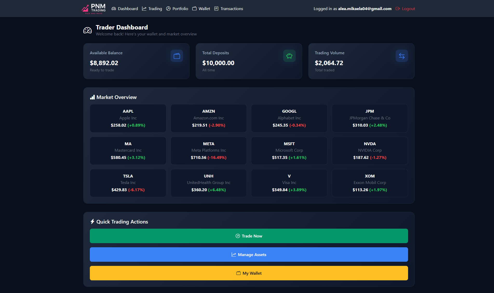
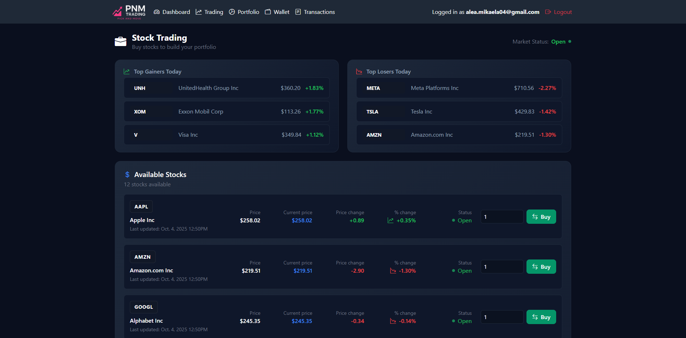
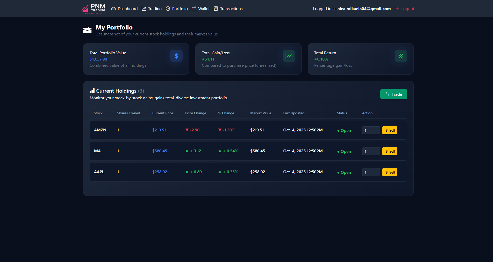
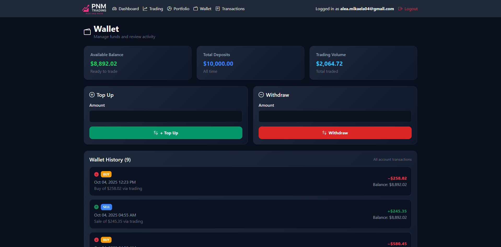
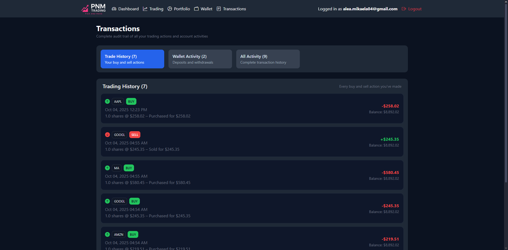
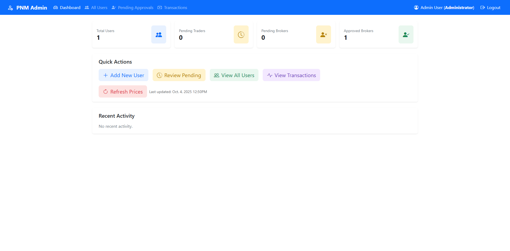

# Stock Trading App

A full-featured stock trading application built with Ruby on Rails that allows users to buy and sell stocks, manage portfolios, and track their trading activity in real-time.

## Screenshots

### User Dashboard


### Trading Interface


### Portfolio Management


### Wallet System


### Transactions


### Admin Dashboard


## Features

- **User Authentication & Authorization**
  - Secure user registration and login with Devise
  - Email confirmation for new accounts
  - Role-based access control (Admin, Trader, Broker)
  - Broker application and approval system

- **Stock Trading**
  - Real-time stock price updates via Finnhub API
  - Buy and sell stocks
  - Search and browse available stocks
  - Automatic price updates via background jobs

- **Portfolio Management**
  - View your current holdings
  - Track stock quantities and values
  - Monitor profit/loss for each position
  - Portfolio performance metrics

- **Wallet System**
  - Virtual wallet for managing trading funds
  - Top-up and withdraw funds
  - Transaction history

- **Trade Logging**
  - Complete transaction history
  - Track all buy/sell operations
  - View trade details and timestamps

- **Admin Dashboard**
  - User management and approval
  - Transaction monitoring
  - Broker application approvals
  - System administration tools

- **Real-time Updates**
  - Background jobs for automatic stock price updates
  - Scheduled price refresh using Solid Queue

## Tech Stack

- **Framework**: Ruby on Rails 8.0
- **Database**: PostgreSQL
- **Authentication**: Devise with JWT
- **Background Jobs**: Solid Queue
- **Caching**: Solid Cache
- **Web Server**: Puma with Thruster
- **Frontend**: Hotwire (Turbo + Stimulus)
- **Asset Pipeline**: Propshaft
- **API Integration**: Finnhub API for stock data
- **Testing**: RSpec, Capybara

## Installation

1. **Clone the repository**
   ```bash
   git clone https://github.com/amlopez04/stock-trading-app.git
   cd stock-trading-app
   ```

2. **Install dependencies**
   ```bash
   bundle install
   ```

3. **Set up environment variables**
   
   Create a `.env` file in the root directory:
   ```env
   FINNHUB_API_KEY=your_finnhub_api_key_here
   POSTGRES_USERNAME=your_postgres_username
   POSTGRES_PASSWORD=your_postgres_password
   RAILS_MASTER_KEY=your_rails_master_key
   ```

   You can get a free Finnhub API key from [finnhub.io](https://finnhub.io)

4. **Set up the database**
   ```bash
   rails db:create
   rails db:migrate
   rails db:seed
   ```

5. **Start the Rails server**
   ```bash
   rails server
   ```

   Or use the development script:
   ```bash
   bin/dev
   ```

6. **Visit the application**
   
   Open your browser and navigate to `http://localhost:3000`

## Configuration

### Database Configuration

The application uses PostgreSQL. Configure your database settings in `config/database.yml` or via environment variables:

- `POSTGRES_USERNAME`
- `POSTGRES_PASSWORD`
- `DATABASE_URL` (for production)

### Finnhub API Setup

1. Sign up for a free account at [finnhub.io](https://finnhub.io)
2. Get your API key from the dashboard
3. Add it to your `.env` file as `FINNHUB_API_KEY`

### Background Jobs

The app uses Solid Queue for background job processing. Stock prices are automatically updated via scheduled jobs. Configure the schedule in `config/schedule.rb` and `config/recurring.yml`.

To start the job processor:
```bash
bin/jobs
```

## Usage

### For Traders

1. **Register an account** and confirm your email
2. **Top up your wallet** with virtual funds
3. **Browse stocks** and view current prices
4. **Buy stocks** by selecting a stock and quantity
5. **Sell stocks** from your portfolio
6. **Monitor your portfolio** and track performance

### For Admins

1. Access the admin panel at `/admin`
2. Approve or reject user registrations
3. Manage broker applications
4. View all system transactions
5. Monitor user activity

### For Brokers

1. Apply for broker status through your profile
2. Wait for admin approval
3. Access broker-specific features once approved

## Testing

Run the test suite with RSpec:

```bash
bundle exec rspec
```

For specific test files:
```bash
bundle exec rspec spec/models/stock_spec.rb
bundle exec rspec spec/requests/trades_buy_spec.rb
```


## Project Structure

```
stock-trading-app/
├── app/
│   ├── controllers/     # Application controllers
│   ├── models/          # ActiveRecord models
│   ├── services/        # Business logic services
│   ├── jobs/            # Background jobs
│   ├── views/           # ERB templates
│   └── assets/          # CSS and images
├── config/              # Configuration files
├── db/                  # Database migrations and schema
├── spec/                # RSpec test files
└── public/              # Static assets
```


**Note**: This is a demo/training application. It uses virtual funds and is not connected to real stock exchanges. Do not use real money with this application.
